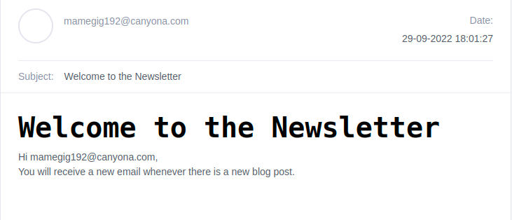
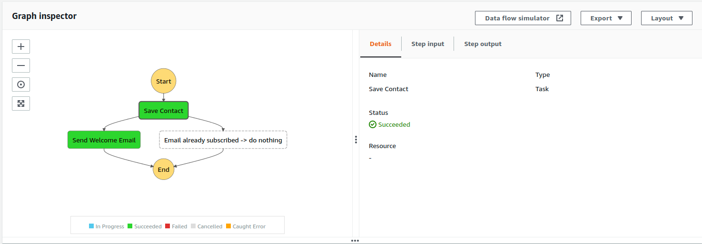

# Build a Serverless Mailchimp Clone with AWS Step Functions and Amazon Simple Email Service - Part 1 - Subscribe endpoint

Today, we learn how to set up a AWS Step Functions state machine, integrating with Amazon Simple Email Service and AWS API Gateway, setting minimal permissions via AWS IAM - all from the AWS CLI for reproducability - in order to build a subscribe endpoint for an email newsletter. I will also include how to verify that everything works, as well as pitfalls and troubleshooting tips.

We will create the `POST /subscribe` endpoint for an email newsletter service hosted on API Gateway. On a new subscriber's HTTP request, we trigger a subscription workflow, in our case, saving the new contact and sending a welcome email. The workflow is modeled using a Step Functions state machine. Managing contacts and sending email is handled via Simple Email Service.

To do this, we first setup Simple Email Service and get comfortable using it. Then, we build the workflow with Step Functions including setting up permissions. Finally, we setup the `POST /subscribe` endpoint on API Gateway, link it to Step Functions using an Integration, and again, set up permissions. As a bonus, we enable CORS on our new API so that the blog can make an http post request to subscribe the reader using JavaScript.

You can find the full example code including all commands without the explanations in this [GitHub repository](https://github.com/mkraenz/blog-serverless-mailchimp-clone).

> Disclaimer: Both the AWS Console and AWS CLI are great for learning. If, however, you are trying to build some actual service, I recommend using the AWS CLI for finding out the right command, and then codifying everything in an Infrastructure-as-Code tool like [AWS CloudFormation](https://aws.amazon.com/cloudformation/), [AWS SAM](https://aws.amazon.com/serverless/sam/), [AWS CDK](https://aws.amazon.com/cdk/), [Terraform](https://www.terraform.io/), or [Pulumi](https://www.pulumi.com/). Using such a tool, the whole deployment will just be one or two commands. For beginners, I recommend AWS SAM which is specifically for building serverless applications.

## Target Workflow


<!--  -->

This workflow is going to be triggered by the following HTTP request:

```http
POST YOUR_AWS_API_GATEWAY_URL/subscribe
Content-Type: application/json

{
  "email": "hello@example.com"
}
```

## Contents

<!-- TODO don't include the blog title here. it autogenerates on save -->

- [Build a Serverless Mailchimp Clone with AWS Step Functions and Amazon Simple Email Service - Part 1 - Subscribe endpoint](#build-a-serverless-mailchimp-clone-with-aws-step-functions-and-amazon-simple-email-service---part-1---subscribe-endpoint)
  - [Target Workflow](#target-workflow)
  - [Contents](#contents)
  - [Motivation](#motivation)
  - [Pricing](#pricing)
  - [Prerequisites](#prerequisites)
  - [Setup Simple Email Service (SES)](#setup-simple-email-service-ses)
    - [Create an Identity and Verify](#create-an-identity-and-verify)
    - [Create the Welcome Email Template](#create-the-welcome-email-template)
    - [Test Render the Welcome Email](#test-render-the-welcome-email)
    - [Send Your First Templated Email](#send-your-first-templated-email)
      - [Troubleshooting](#troubleshooting)
      - [Congratz on Sending Your First Email](#congratz-on-sending-your-first-email)
    - [Create a Contact List](#create-a-contact-list)
  - [Build the Subscribe-to-Newsletter Workflow with Step Functions](#build-the-subscribe-to-newsletter-workflow-with-step-functions)
    - [Create the Execution Role for Step Functions](#create-the-execution-role-for-step-functions)
    - [Create the Step Functions State Machine](#create-the-step-functions-state-machine)
    - [Validate the workflow](#validate-the-workflow)
      - [Troubleshooting your State Machine](#troubleshooting-your-state-machine)
  - [Setup API Gateway and invoke your subscribe workflow via HTTP](#setup-api-gateway-and-invoke-your-subscribe-workflow-via-http)
    - [Create API Gateway API](#create-api-gateway-api)
    - [Create a route and call the Step Functions state machine](#create-a-route-and-call-the-step-functions-state-machine)
    - [Test your Subscription API](#test-your-subscription-api)
    - [Bonus: Setup CORS](#bonus-setup-cors)
  - [Next Steps](#next-steps)
  - [Cleanup](#cleanup)
  - [Closing](#closing)
  - [References](#references)

## Motivation

A little while ago, a good friend of mine said she wanted to add an email newsletter to her blog to stay in contact with her readers. Whenever she publishes a new blog article, an email should be sent to her newsletter subscribers informing them about the new article and inviting them to read the article on her blog.

Since she still has a fairly small followership she does't want to pay the monthly fee for services like [MailChimp](https://mailchimp.com/) yet. On the other hand, the free tier of Mailchimp only allows to send emails with the MailChimp logo in the footer - which doesn't look too great.

Fitting my objective of getting deeper into Serverless Computing, particularly AWS Step Functions, I decided to build this in our Twitch stream, the [TypeScriptTeatime](https://www.twitch.tv/typescriptteatime). You can watch everything using this [video playlist](https://www.twitch.tv/collections/gsh4RG33FheZdw).

Why serverless? Serverless Computing provides us with the benefit that as long as usage is low, we have close-to-zero operative costs. Further, the approach is future proof as our infrastructure will automatically scale to large numbers of users without any further work needed. Step Functions is very useful in making our workflow visible which helps in communication. Be aware though that there is an important disadvantage to our approach - there is no visual editor to build the email templates.

## Pricing

AWS provides [a free tier](https://aws.amazon.com/free/) for the first 12 month after account creation. Moreover, AWS Step Functions stays free forever up to some thresholds. The identity and access management service AWS IAM is completely free. What's left is costs for Amazon Simple Email Service (SES). Sending 1000 emails costs about $0.10 (costs may vary depending on your region).

As an example, if you publish a blog article every day, then 1 Dollar covers the cost of sending daily email notifications to about 333 subscribers for one month.

## Prerequisites

- AWS account. If you don't have an account yet, you can create one here via the [AWS website](https://aws.amazon.com/).
- [AWS CLI](https://docs.aws.amazon.com/cli/latest/userguide/cli-chap-welcome.html) installed and configured (I tested this with `aws-cli/2.7.31 Python/3.9.11` on Ubuntu Linux)
- Access permissions on your user (I tested with `AdministratorAccess` policy. `PowerUserAccess` does not suffice since at least the `iam:CreateRole` permission is missing.)
- default profile and default region set in your AWS CLI config

If you don't want to setup default profile and region, you can pass the `--profile YOUR_PROFILE` and `--region YOUR_REGION` flags to each of the AWS CLI commands. But it's definitely more comfortable to use defaults.

## Setup Simple Email Service (SES)

At the end of this series, our goal is to send email notifications to our subscribers whenever there is a new blog post. We will heavily leverage [AWS Simple Email Service](https://aws.amazon.com/ses/) (SES) to do this.

SES a service that allows you to send emails, manage mailing list, create email template, send those template emails, and more.

### Create an Identity and Verify

First, we need to create an identity to send emails from.
In AWS SES, this can either be an email or a domain you own.
For the sake of simplicity, we use an email address in this article.
SES will send a verification email to this address to verify that you own this email address.
SES does this to stop spammers and other malicious intents.

You can use a fake email like temp-mail, but remember to clear the inbox after you are done with this tutorial for your privacy's sake.

```sh
EMAIL_ADDRESS='YOUR_EMAIL_ADDRESS'
aws sesv2 create-email-identity --email-identity $EMAIL_ADDRESS
```

Example:

```sh
EMAIL_ADDRESS='hello@example.com'
aws sesv2 create-email-identity --email-identity $EMAIL_ADDRESS
```

Once you've ran the command, you should find an email in your inbox from AWS within a few minutes. Click on the link to verify the email address.

> Note: Without further setup. you will be in **SES Sandbox Mode**, meaning that you can only send emails to verified email addresses (i.e. SES identities), or the [SES Mailbox Simulator](https://docs.aws.amazon.com/ses/latest/dg/send-an-email-from-console.html#send-email-simulator). To get into production mode, check these [docs](https://docs.aws.amazon.com/ses/latest/DeveloperGuide/request-production-access.html). For production, you should further setup authentication with SPF and email signing with DKIM. Find more on authentication [here](https://docs.aws.amazon.com/ses/latest/dg/tips-and-best-practices.html#authentication-considerations:~:text=in%20their%20feedback.-,Authentication,-Authenticate%20your%20domain).

### Create the Welcome Email Template

We will be using the command [create-email-template](https://docs.aws.amazon.com/cli/latest/reference/sesv2/create-email-template.html) command with the `--cli-input-json` flag to pass the template as a JSON file. This is much easier than having to format and escape everything correctly for direct CLI input. To learn more about the flag, see [here](https://docs.aws.amazon.com/cli/latest/userguide/cli-usage-skeleton.html).

Anyway, let's create the input JSON file `welcome.create-email-template.input.json`:

```json
{
  "TemplateName": "WelcomeTemplate",
  "TemplateContent": {
    "Subject": "Welcome to the Newsletter",
    "Text": "Welcome to the Newsletter. You will receive a new email whenever there is a new blog post.",
    "Html": "<h1>Welcome to the Newsletter</h1><p>Hi {{email}},</><p>You will receive a new email whenever there is a new blog post.</p>"
  }
}
```

If you wonder what the `Text` property is about that is for subscribers who's email client doesn't support rendering HTML, for example older versions of Outlook.

The `{{email}}` is a placeholder that will be replaced with the actual email address when the email is sent, assuming we provide the corresponding _template data_ (sometimes also called template variables). In a more complex setup, you will likely have placeholders for the name of the subscriber, or other information.

Continuing on, we can now create the template with:

```sh
aws sesv2 create-email-template --cli-input-json file://welcome.create-email-template.input.json
```

### Test Render the Welcome Email

To ensure the bare minimum of the email works, you can render a preview with [test-render-email-template](https://docs.aws.amazon.com/cli/latest/reference/sesv2/test-render-email-template.html) endpoint.

```sh
aws sesv2 test-render-email-template \
  --template-name WelcomeTemplate \
  --template-data '{"email":"hello@example.com"}'
```

`--template-data` is a _stringified JSON_ that contains the data to render the template with. These are the template variables that will replace the corresponding `{{email}}` placeholder in the template. Depending on your template, there might be more template variables required like a `name` property.

Troubleshooting: If you run into errors during rendering, make sure you provided all template variables, and that you properly escape your stringified JSON for the `--template-data`. For fixing the template itself, you can use the command [update-email-template](https://docs.aws.amazon.com/cli/latest/reference/sesv2/update-email-template.html).

### Send Your First Templated Email

To send an actual email for testing, we will use the [send-email](https://docs.aws.amazon.com/cli/latest/reference/sesv2/send-email.html) command.

Let's create the input JSON file `send-email.input.json`. Be sure to replace `YOUR_SENDER_EMAIL_ADDRESS`, `YOUR_DESTINATION_EMAIL_ADDRESS`, `YOUR_REGION`, and `YOUR_ACCOUNT_ID`. For starters, I recommend you use the same email for sender and destination due to the SES Sandbox restrictions mentioned above.

```json
{
  "FromEmailAddress": "YOUR_SENDER_EMAIL_ADDRESS",
  "Destination": {
    "ToAddresses": ["YOUR_DESTINATION_EMAIL_ADDRESS"]
  },
  "Content": {
    "Template": {
      "TemplateName": "WelcomeTemplate",
      "TemplateArn": "arn:aws:ses:YOUR_REGION:YOUR_ACCOUNT_ID:template/WelcomeTemplate",
      "TemplateData": "{\"email\":\"YOUR_DESTINATION_EMAIL_ADDRESS\"}"
    }
  }
}
```

For example,

```json
{
  "FromEmailAddress": "hello@example.com",
  "Destination": {
    "ToAddresses": ["subscriber@example.com"]
  },
  "Content": {
    "Template": {
      "TemplateName": "WelcomeTemplate",
      "TemplateArn": "arn:aws:ses:us-east-1:12345689012:template/WelcomeTemplate",
      "TemplateData": "{\"email\":\"subscriber@example.com\"}"
    }
  }
}
```

Finally, send the email with:

```sh
aws sesv2 send-email --cli-input-json file://send-email.input.json
```

The command response should be a JSON containing a message id property. This indicates success from AWS SES. Unfortunately, success is very relative... For now, check your inbox to see if the email has arrived.
It should look something like this:



<!--  -->

If it does not arrive after a few minutes, continue to the following Troubleshooting section.

#### Troubleshooting

There are some pitfalls to sending an email while you are in the SES Sandbox mode. Most importantly,

> You can only send to verified email addresses (i.e. identities).

Other than that, if you use a Gmail address as sender and try to send to the same email, it unfortunately will never appear in your Gmail inbox even though Amazon SES reports success. _Gmail seems to block such attempts_ silently.
Other email providers might do the same.
You can work around this by creating another identity with, for example, [temp mail](https://temp-mail.org/en/), verify it, and send to that email address using the Gmail address as sender.

If that still does not help, login to the AWS Console (i.e. the web UI), navigate to the SES service, and go to `Account Dashboard`.
Make sure you are in the correct region!
Scroll down until you find a button `View in Cloud Watch`. Follow the link to head over to AWS' log management service Cloud Watch.
You will be placed on the `Graphed Metrics` tab but you want to go to the `Browse` tab. Here, mark all possible metrics (Delivery, RenderingFailure, etc) to see what happened to your email up in the graph.
From what it looks like, Cloud Watch receives new SES data only once per hour. So you might need to wait an hour or two to see what happened to your email.

#### Congratz on Sending Your First Email

🎉 Congratulations! 🥳 That's it for the basic email template setup. For many use-cases this might already be all you need. In our use-case it does not quite suffice. Remember, we want to send emails to our subscribers whenever there is a new blog post. So, we need a way to create and manage our subscribers. We will be using _SES Contact Lists_ for this.

### Create a Contact List

A contact list is a list of email addresses that you want to send emails to. In our case, these will be our newsletter subscribers.
While SES contact lists can do more than just save emails, we will stick with this basic usage.
If you'd like to know more, check out [SES Topics](https://docs.aws.amazon.com/ses/latest/APIReference-V2/API_Topic.html). Here, we have exactly one topic to which all contacts in the contact list are subscribed.

To create a contact list, first, create a json file `create-contact-list.input.json` with the following content:

```json
{
  "ContactListName": "EmailNewsletter",
  "Description": "Our blog newsletter email list",
  "Topics": [
    {
      "TopicName": "Newsletter",
      "DisplayName": "Blog Post Newsletter",
      "Description": "Never miss a new blog post by subscribing to our newsletter.",
      "DefaultSubscriptionStatus": "OPT_OUT"
    }
  ]
}
```

Then, create the contact list with [create-contact-list](https://docs.aws.amazon.com/cli/latest/reference/sesv2/create-contact-list.html):

```sh
aws sesv2 create-contact-list --cli-input-json file://create-contact-list.input.json
```

> Note: AWS allows _only a single contact list per region_. It is not possible to request a quota increase from the AWS Console, and I am unaware of whether it is possible to request a quota release by contacting support directly. You can however have multiple topics within one contact list.

Let's validate that everything was setup successfully by creating a new contact. Remember to replace `YOUR_CONTACTS_EMAIL_ADDRESS` in the [create-contact](https://docs.aws.amazon.com/cli/latest/reference/sesv2/create-contact.html) command.

```sh
CONTACTS_EMAIL_ADDRESS="YOUR_CONTACTS_EMAIL_ADDRESS"
aws sesv2 create-contact --contact-list-name "EmailNewsletter" --email-address $CONTACTS_EMAIL_ADDRESS
```

For example,

```sh
CONTACTS_EMAIL_ADDRESS="hello@example.com"
aws sesv2 create-contact --contact-list-name "EmailNewsletter" --email-address $CONTACTS_EMAIL_ADDRESS
```

Next, we list all contacts that are subscribed to our newsletter with [list-contacts](https://docs.aws.amazon.com/cli/latest/reference/sesv2/list-contacts.html).

```sh
aws sesv2 list-contacts --contact-list-name "EmailNewsletter"
```

If your output looks similar to the following, everything worked.

```json
{
  "Contacts": [
    {
      "EmailAddress": "hello@example.com",
      "TopicDefaultPreferences": [
        {
          "TopicName": "Newsletter",
          "SubscriptionStatus": "OPT_OUT"
        }
      ],
      "UnsubscribeAll": false,
      "LastUpdatedTimestamp": "2022-09-15T13:00:00.000000+00:00"
    }
  ]
}
```

Let's clean up the contacts by deleting the contact we just created with [delete-contact](https://docs.aws.amazon.com/cli/latest/reference/sesv2/delete-contact.html).

```sh
CONTACTS_EMAIL_ADDRESS="YOUR_CONTACTS_EMAIL_ADDRESS"
aws sesv2 delete-contact --contact-list-name "EmailNewsletter" --email-address $CONTACTS_EMAIL_ADDRESS
```

Congratulations! Let's dive into connecting these commands using a AWS Step Functions state machine.

## Build the Subscribe-to-Newsletter Workflow with Step Functions

We will now get into modeling the actual subscribe-workflow that uses the SES api calls to, first, save a new subscriber as a new contact, and second, send a welcome email to this new subscriber. Step Functions uses the term _state machine_ to refer to the workflow because it models business workflows as state machines. A state machine is some collection of _states_ and _transitions_ between states. States are, for example, api calls to other AWS services, if-else statements, or data transformations. Transitions describe how to go from one state to the next state, and what data to pass on to the next state.

It's a lot of fun to use Step Functions' _visual workflow editor_ from within AWS Console. If this is your first time using Step Functions I absolutely recommend you check it out. Aside from being a great way to collaborate with colleagues and even business people, Step Functions automatically creates the permissions for api calls to AWS Lambda functions, DynamoDB and many more. For a full list of these _optimized integrations_, see [here](https://docs.aws.amazon.com/step-functions/latest/dg/connect-supported-services.html). It automatically generates the workflow code for you so you can just copy-paste it to your git repository to follow infrastructure-as-code.

Unfortunately, since we are focusing on the AWS CLI here, we have to handle permissions manually. At least we have more control and can reproduce our results more easily using the CLI than the UI, right? :) Also, the UI cannot create permissions for SES api calls anyway because SES is not an optimized integration. The UI does warn us of such missing permissions.

In this chapter, we will create an IAM role that has exactly the permissions to create an email contact in SES, and send the welcome email via SES. Next, we create the subscription workflow using AWS Step Functions. Finally, we validate that our workflow works as expected.

### Create the Execution Role for Step Functions

First, we create a JSON that contains the permissions for the Step Functions state machine to call SES apis.
Second, we add a JSON for the trust policy to allow our state machine to use the role.
Third, we use the CLI to create the role, and finally attach the permissions to the new role.

Let's create a file `stepfunctions-newsletter-subscribe.policy.json` with the following content.
As before, be sure to replace `YOUR_ACCOUNT_ID` and `YOUR_REGION` in the JSON.

```json
{
  "Version": "2012-10-17",
  "Statement": [
    {
      "Effect": "Allow",
      "Action": "ses:SendTemplatedEmail",
      "Resource": [
        "arn:aws:ses:YOUR_REGION:YOUR_ACCOUNT_ID:identity/*",
        "arn:aws:ses:YOUR_REGION:YOUR_ACCOUNT_ID:template/WelcomeTemplate"
      ]
    },
    {
      "Effect": "Allow",
      "Action": "ses:CreateContact",
      "Resource": "arn:aws:ses:YOUR_REGION:YOUR_ACCOUNT_ID:contact-list/EmailNewsletter"
    }
  ]
}
```

Note that we reuse the template name `WelcomeTemplate`, and the contact list `EmailNewsletter` that we've created earlier. If you've changed any of the names in a previous step, be sure to adjust these values, too.

Second, create the following trust policy, so the Step Function can assume the role. If you use the web interface AWS Console to create a Step Functions state machine, this would be created automatically for you. This allows our Step Function to use the role we attach to it, and, by extension, use the permissions to get access to SES. As filename we choose `stepfunctions-newsletter-subscribe.trust-policy.json`.

```json
{
  "Version": "2012-10-17",
  "Statement": [
    {
      "Effect": "Allow",
      "Principal": {
        "Service": "states.amazonaws.com"
      },
      "Action": "sts:AssumeRole"
    }
  ]
}
```

Here, `states.amazonaws.com` refers to the Step Functions service. For some reason, they call it `states` and not `stepfunctions`. I could not figure out why.

Anyway, now we can [create the role](https://awscli.amazonaws.com/v2/documentation/api/latest/reference/iam/create-role.html) with the trust policy.

```sh
aws iam create-role \
 --role-name StepFunctionsNewsletterSubscribeRole \
 --assume-role-policy-document file://stepfunctions-newsletter-subscribe.trust-policy.json
```

The final step here is to attach the policy to the role. We use the [put-role-policy](https://docs.aws.amazon.com/cli/latest/reference/iam/put-role-policy.html) endpoint to create an inline policy on the role in a single command to save us the trouble of creating a separate policy and attaching it to the role in two commands.

```sh
aws iam put-role-policy \
    --role-name StepFunctionsNewsletterSubscribeRole \
    --policy-name StepFunctionsNewsletterSubscribePolicy \
    --policy-document file://stepfunctions-newsletter-subscribe.policy.json
```

Et voila, we have the policy chores taken care of.
Now we can create the Step Functions state machine!

### Create the Step Functions State Machine

Finally, we get into the real action - creating the workflow with Step Functions that we saw at the very top of the article.

Create a file `newsletter-subscribe.asl.json` with the following content. ASL stands for Amazon State Language (ASL), a JSON-based language for describing workflows. You can find a [full reference in the docs](https://docs.aws.amazon.com/step-functions/latest/dg/concepts-amazon-states-language.html).

Remember to replace `YOUR_SENDER_EMAIL`, `YOUR_REGION`, and `YOUR_ACCOUNT_ID` with the email address you verified in SES.

```json
{
  "Comment": "Saves the email of a new subscriber and sends a welcome email.\nThis workflow is being called by an API Gateway integration using, for example, `POST { \"email\": \"hello@example.com\" }`.",
  "StartAt": "Save Contact",
  "States": {
    "Save Contact": {
      "Type": "Task",
      "Parameters": {
        "ContactListName": "EmailNewsletter",
        "EmailAddress.$": "$.email"
      },
      "Resource": "arn:aws:states:::aws-sdk:sesv2:createContact",
      "ResultPath": null,
      "Next": "Send Welcome Email",
      "Catch": [
        {
          "ErrorEquals": ["SesV2.AlreadyExistsException"],
          "Next": "Email already subscribed -> do nothing",
          "Comment": "Email already subscribed"
        }
      ]
    },
    "Send Welcome Email": {
      "Type": "Task",
      "Parameters": {
        "FromEmailAddress": "YOUR_SENDER_EMAIL",
        "Destination": {
          "ToAddresses.$": "States.Array($.email)"
        },
        "Content": {
          "Template": {
            "TemplateName": "WelcomeTemplate",
            "TemplateArn": "arn:aws:ses:YOUR_REGION:YOUR_ACCOUNT_ID:template/WelcomeTemplate",
            "TemplateData": {
              "email.$": "$.email"
            }
          }
        }
      },
      "Resource": "arn:aws:states:::aws-sdk:sesv2:sendEmail",
      "End": true
    },
    "Email already subscribed -> do nothing": {
      "Type": "Succeed"
    }
  }
}
```

**What this does:**

When this state machine is executed, it will first try to save the email address of the new subscriber to the contact list `EmailNewsletter`. If the email address is already in the list, SES will error with an `SesV2.AlreadyExistsException` error, the state machine will catch the error and move on to the next state. This is configured by the `Catch` property. If the email address is not in the list, SES saves the contact, and the state machine will continue to the next state, which sends the welcome email. With `"ResultPath": null,` we ensure that the input of the `Save Contact` state including the email address is passed down to the `Send Welcome Email` state.

Feel free to go to the AWS Console -> Step Functions -> State Machines -> Create state machine and copy-paste the workflow into the code editor. Then check out what this looks like with the Visual Editor and fiddle around with it.

It should look like to this in the visual editor:


<!--  -->

And it should preview like this in the code editor:


<!--  -->

One point to note is that while `TemplateData` in `aws sesv2 send-email ...` needed to be a stringified JSON, in Step Functions we can simply pass a proper JSON object and it still works! Automagically, Step Functions will stringify the JSON object for us.

We will now use the [create-state-machine](https://docs.aws.amazon.com/cli/latest/reference/stepfunctions/create-state-machine.html) endpoint to deploy the state machine.

```sh
ACCOUNT_ID="YOUR_ACCOUNT_ID"
aws stepfunctions create-state-machine \
    --name "NewsletterSubscribe" \
    --definition file://newsletter-subscribe.asl.json \
    --role-arn "arn:aws:iam::${ACCOUNT_ID}:role/StepFunctionsNewsletterSubscribeRole"
```

Note: If you made a mistake with attaching the role to the state machine, you **cannot use** `create-state-machine` to change the role. You will need to use [update-state-machine](https://docs.aws.amazon.com/cli/latest/reference/stepfunctions/update-state-machine.html) to fix it instead. Or you can delete and recreate the state machine.

If you are very attentive, you might notice that we do not use `ses:SendTemplatedEmail` but `sesv2:sendEmail` here. The former is the old SES API, the latter is the new SES API which identifies 3 different endpoints into one using different input parameters. We use sendEmail with the `Content.Template` parameter. On a permissions level, we have to allow `ses:SendTemplatedEmail` to make it work. This is a bit confusing, but it is what it is. My guess is that internally `sesv2:sendEmail` with `Content.Template` forwards to `ses:SendTemplatedEmail`.

### Validate the workflow

Let's immediately try out our new workflow. The best way to do this is via the AWS Console, or see below on how to do it from the CLI. I encourage you to do it at least once using the AWS Console though... to see the work _flow_.

So login to [AWS](http://aws.amazon.com/), select your region from the top, and go to the Step Functions service. From the sidebar, select _State machines_. Then select our newly created state machine named `NewsletterSubscribe`. Click on it and then click on the "Start Execution" button. In the dialog that opens, provide the following state machine input (replace `YOUR_CONTACT_EMAIL` with your email address that is validated in SES) and click on "Start Execution".

```json
{
  "email": "YOUR_CONTACT_EMAIL"
}
```

If everything goes fine, you see the flow your code has taken. Here's an example of what it looks like:



<!--  -->

For a more automated approach, here's the CLI command to do the same thing using [start-execution](https://docs.aws.amazon.com/cli/latest/reference/stepfunctions/start-execution.html):

```sh
REGION="YOUR_REGION"
ACCOUNT_ID="YOUR_ACCOUNT_ID"
CONTACTS_EMAIL_ADDRESS="YOUR_CONTACT_EMAIL"
aws stepfunctions start-execution \
    --state-machine-arn "arn:aws:states:${REGION}:${ACCOUNT_ID}:stateMachine:NewsletterSubscribe" \
    --input "{\"email\" : \"${CONTACTS_EMAIL_ADDRESS}\"}"
```

The CLI will just return a JSON object with the execution ARN. You can use that to check the status of the execution. For example, you can use [describe-execution](https://docs.aws.amazon.com/cli/latest/reference/stepfunctions/describe-execution.html) to check the status of the execution:

```sh
EXECUTION_ARN="YOUR_EXECUTION_ARN" # as returned by start-execution
aws stepfunctions describe-execution \
    --execution-arn $EXECUTION_ARN
```

Within the response JSON, the most important information is `"status": "SUCCEEDED"`. Of course, we can also check the email inbox of the contact email address to see if the welcome email arrived.

If it worked for you, congratulations! You have successfully created a workflow with Step Functions. You can now go ahead and create the API Gateway endpoint to allow users to subscribe to your newsletter using POST requests. If not, here are some things to check:

#### Troubleshooting your State Machine

If the workflow fails, one of the states in the diagram should be highlighted in red. Click on it. In the details that open, you find a tab _Exception_. Here you find a summary of the error. If the error is clear enough for you too fix, awesome. Let's go fix it. You can also check the tab _Step Input_ to check whether the data passed into the state is correct.

If you need further information, scroll down the page to the _Execution event history_ table. One of these events should say _TaskFailed_. Check the event and the surrounding events to find out what happened in detail.

Here are a few errors into which I ran and how to resolve them:

- `User: arn:aws:sts::1111111111:assumed-role/StepFunctionsNewsletterSubscribeRole/ASDF is not authorized to perform: ...`
  - Double check that you attached the correct role to the state machine. Easiest to do via the AWS Console -> Step Functions.
  - Double check that the role has the correct permissions. Easiest to do via the AWS Console -> IAM.
- `SesV2.AlreadyExistsException`
  - You are already subscribed with this email address.
  - This should be handled by the workflow's error handling (`Catch` block).
  - If you got rid of the error handling, delete the contact with [delete-contact](https://docs.aws.amazon.com/cli/latest/reference/sesv2/delete-contact.html), or try again with a different email address but remember to validate it in SES!
- Workflow is green but no email received in your inbox
  - Via the Step Functions UI verify that the _Step Input_ of the execution used the correct email.
  - Ensure that sending works via `aws sesv2 send-email` as described in this [previous section](#send-your-first-templated-email). You can find more troubleshooting information about this issue in that section.

## Setup API Gateway and invoke your subscribe workflow via HTTP

Now that we've got SES and our Step Functions state machine set up, let's allow a subscriber to send a `POST` request to subscribe. We will use API Gateway to do this.

### Create API Gateway API

We start by creating an API object. This is the top level object that will contain all our routes. We will use the [create-api](https://docs.aws.amazon.com/cli/latest/reference/apigatewayv2/create-api.html) endpoint to do this.

```sh
aws apigatewayv2 create-api \
    --name "Newsletter" \
    --protocol-type HTTP \
    --description "API for managing the blog newsletter"
```

Take a note of the `ApiId` returned from the command. We will use it in the next few steps. If you missed to copy it, use `aws apigatewayv2 get-apis` to list all your APIs.

The `--protocol-type HTTP` option is one of the 3 available options of APIs on API Gateway. The others being `WEBSOCKET` and REST APIs. Since we want to receive `POST` requests and our use-case is fairly simple, we use `HTTP`. REST APIs are the powerful big sis of HTTP APIs in AWS. They are more flexible and allow you to do more things. But they are also more complex to set up and use. They are also not created using `apigatewayv2` but `apigateway`.

For API Gateway to actually provision a URL that we can `POST` to from our blog website, we need to create what's called a Stage with [create-stage](https://docs.aws.amazon.com/cli/latest/reference/apigatewayv2/create-stage.html). A stage is a version of the API that is deployed. For example, you could have multiple stages for v1 and v2 of your api. We will just use the default stage name referenced by the keyword `$default`. Using the default stage name allows us to have no route prefix in the URL later on.

```sh
API_ID='YOUR_API_ID'
aws apigatewayv2 create-stage \
    --api-id $API_ID \
    --stage-name '$default' \
    --auto-deploy
```

Thanks to `--auto-deploy` our changes to the API will always be deployed automatically. This is great for development, but you might want to disable this in production.

### Create a route and call the Step Functions state machine

In API Gateway HTTP APIs, we create routes like `POST /subscribe` and attach _integrations_ to it. In our case, the integration is a configuration to invoke our Step Functions state machine. We will configure the integration to pass down the JSON request body to Step Functions so that our state machine can access the `email`.

To do this, we need to give our API the permissions to invoke our Step Functions state machine. We do this by creating a role with the correct permissions and attaching it to the API. This is analog to what we did before to allow our Step Functions state machine to invoke SES. So let's get to it.

We start with the trust policy of the role so our API can assume the role. Create a file `apigateway-execution-role.trust-policy.json` with the following content

```json
{
  "Version": "2012-10-17",
  "Statement": [
    {
      "Effect": "Allow",
      "Principal": {
        "Service": "apigateway.amazonaws.com"
      },
      "Action": "sts:AssumeRole"
    }
  ]
}
```

Next, we prepare the policy containing the permissions for our API to start our Step Functions state machine. The corresponding permission within Step Functions (= `states`) is `StartExecution`. Let's put everything in a file `stepfunctions-start-execution-of-newsletter-subscribe.policy.json`. Be sure to replace `YOUR_REGION` and `YOUR_ACCOUNT`.

```json
{
  "Version": "2012-10-17",
  "Statement": [
    {
      "Effect": "Allow",
      "Action": "states:StartExecution",
      "Resource": "arn:aws:states:YOUR_REGION:YOUR_ACCOUNT:stateMachine:NewsletterSubscribe"
    }
  ]
}
```

With this, create the role and attach the policy to it.

```sh
aws iam create-role \
    --role-name ApiGatewayExecutionRoleForStepFunctionsNewsletterSubscribe \
    --assume-role-policy-document file://apigateway-execution-role.trust-policy.json

aws iam put-role-policy \
    --role-name ApiGatewayExecutionRoleForStepFunctionsNewsletterSubscribe \
    --policy-name StepFunctionsStartExecutionOfNewsletterSubscribe \
    --policy-document file://stepfunctions-start-execution-of-newsletter-subscribe.policy.json
```

Next, we create the integration to our Step Functions state machine using [create-integration](https://docs.aws.amazon.com/cli/latest/reference/apigatewayv2/create-integration.html). We need the API ID from before to do this. Again, if you lost track of it, use `aws apigatewayv2 get-apis` to list all your APIs.

```sh
API_ID='YOUR_API_ID'
ACCOUNT_ID='YOUR_ACCOUNT_ID'
REGION='YOUR_REGION'

aws apigatewayv2 create-integration \
    --api-id $API_ID \
    --integration-type AWS_PROXY \
    --integration-subtype StepFunctions-StartExecution \
    --credentials-arn "arn:aws:iam::${ACCOUNT_ID}:role/ApiGatewayExecutionRoleForStepFunctionsNewsletterSubscribe" \
    --payload-format-version 1.0 \
    --request-parameters "{\"StateMachineArn\": \"arn:aws:states:${REGION}:${ACCOUNT_ID}:stateMachine:NewsletterSubscribe\", \"Input\": \"\$request.body\"}"
```

Take a note of the returned `IntegrationId`. We will use it in the next step.

Let's try to understand this command. With the help of `--integration-type AWS_PROXY` we tell API Gateway to integrate with _some_ AWS Service. Then, using `--integration-subtype StepFunctions-StartExecution` we specify that it should do a `StartExecution` api call on the Step Functions api. The details of which state machine to invoke and how to invoke it are then defined within `--request-parameters`.

The `--request-parameters`' format is defined in the [integration reference](https://docs.aws.amazon.com/apigateway/latest/developerguide/http-api-develop-integrations-aws-services-reference.html#StepFunctions-StartExecution). Using this stringified JSON, we pass the ARN of our Step Functions state machine and specify that the HTTP request body should be passed to the state machine as input. The `$request.body` is a special syntax that API Gateway uses to refer to the request body. You can find the available options in the [Working with AWS Service Integrations Docs](https://docs.aws.amazon.com/apigateway/latest/developerguide/http-api-develop-integrations-aws-services.html). For anything more complicated than this, I suggest you use `--cli-input-json` instead.

Finally, the `--credentials-arn` is the ARN of the role that API Gateway uses to invoke `StartExecution` with. This is the role we created before.

As a side note, when I constructed the permissions, I started writing this integration and in that process determined the minimal permissions needed to run the integration. So while the commands are executed in the same order as written down in this article, the corresponding research was vice-versa.

Continuing on, we can create the route `POST /subscribe` forwarding to our integration using [create-route](https://docs.aws.amazon.com/cli/latest/reference/apigatewayv2/create-route.html). We need the `ApiId` and `IntegrationId` from `create-integration` to do this. If you lost track of either one, use `aws apigatewayv2 get-apis` or `aws apigatewayv2 get-integrations --api-id YOUR_API_ID` to list all your integrations.

```sh
API_ID='YOUR_API_ID'
INTEGRATION_ID="YOUR_INTEGRATION_ID"
aws apigatewayv2 create-route \
  --api-id $API_ID \
  --route-key 'POST /subscribe' \
  --target "integrations/$INTEGRATION_ID"
```

There we go. Let's check that it works in the next section.

### Test your Subscription API

While we could test our API route using [test-invoke-route](https://docs.aws.amazon.com/cli/latest/reference/apigatewayv2/test-invoke-route.html), it is not quite the same as testing in the real world. To get closer to the real-world, let's test using [curl](https://curl.se/). If you don't have curl installed, you can install it using `sudo apt install curl` on Ubuntu or `brew install curl` on macOS.

```sh
API_ID='YOUR_API_ID'
REGION='YOUR_REGION'
CONTACTS_EMAIL_ADDRESS='YOUR_CONTACT_EMAIL'
curl --request POST \
  --url "https://${API_ID}.execute-api.${REGION}.amazonaws.com/subscribe" \
  --header 'Content-Type: application/json' \
  --data '{"email": "${CONTACTS_EMAIL_ADDRESS}"}'
```

> If you receive authorization errors on the api level, try again in a few minutes. Sometimes API Gateway needs some time to deploy the changes.

The output is a JSON object containing the execution ARN of the Step Functions state machine.
It should look something like this.

```json
{
  "executionArn": "arn:aws:states:us-east-1:123456789012:execution:NewsletterSubscribe:12345678-1234-1234-1234-123456789012",
  "startDate": 1.618033988749895
}
```

If your curl works, that means your Step Functions state machine gets called. Try jumping into the UI again and check the latest execution for the correct input and execution. From your previous execution your email might still be registered as a contact, so possibly the workflow falls back to the `Email already subscribed` state. But that's intented. If you like, delete the contact from the contact list like before with `aws sesv2 delete-contact ...` and rerun the curl.

With the API Gateway endpoint running, the only thing that's left for the real-world is CORS. Onwards, to the bonus section!

### Bonus: Setup CORS

We now have a working API Gateway HTTP API that can be used to subscribe to our newsletter. If the blog that is including the subscribe form is hosted on a different domain and uses JavaScript to send the POST request to `YOUR_API_GATEWAY_URL/subscribe`, we will need to setup CORS. Otherwise, we will get the notorious `blocked by CORS policy` error in our browser dev tools.

Fortunately, API Gateway makes it very simple to do this. We can use the [update-api](https://docs.aws.amazon.com/cli/latest/reference/apigatewayv2/update-api.html) command to update the API with the CORS configuration. The command will only update the CORS configuration and leave the rest of the API untouched. Remember to replace `YOUR_API_ID` and `YOUR_CORS_ORIGIN` with your own values. Here, `YOUR_CORS_ORIGIN` is the domain that is hosting the blog that includes the subscribe form. For example, if the blog is hosted at `https://www.example.com`, then `YOUR_CORS_ORIGIN` should be `https://www.example.com`, including the protocol `https`.

```sh
API_ID='YOUR_API_ID'
ORIGIN='YOUR_CORS_ORIGIN'
# for example, ORIGIN='https://www.example.com'
aws apigatewayv2 update-api --api-id $API_ID --cors-configuration AllowOrigins=$ORIGIN,AllowMethods="POST",AllowHeaders="Content-Type"
```

With this, we allow the blog's domain to send us `POST` requests which have the `Content-Type` header set.

That's all there is to setting up CORS for our purposes! Wasn't that simple? 😊

And with that,

🎉 Congratulations! 🥳 You just built a serverless email subscription API using AWS Step Functions and API Gateway! You also learned how to use Amazon SES to send templated emails. AWSome! 🎉

## Next Steps

This is a great basis to built on top of. Here are some ideas for next steps.

- add an id to the contact
  - either via SES contact's attribute data or by additionally saving the contact to a database like DynamoDB
- handle duplicate email
  - SES' `createContact` API fails if the email already exists.
  - can be done by updating our existing Step Functions state machine and corresponding permissions
- workflow to unsubscribe
  - add a separate route `GET /unsubscribe?id=12345` to unsubscribe from the newsletter
  - requires a new state machine, corresponding permissions, API route and integration
  - Ideally, we also put the unsubscribe link in each email sent to the user.
- workflow to regularly check whether a new blog article was posted
- workflow to send the email once a new blog article was posted

In fact, I will implment each one and write corresponding articles about them in the next few weeks. Stay tuned!

## Cleanup

If you're like me and you don't want all the resources from your learning efforts lying around in your AWS account, then fear not. Here's how to delete all the resources we just created. Removal needs to occur vice-versa to the order of creation. But remember, we may continue with some of this in the next blog article of this series.

```sh
API_ID="YOUR_API_ID"
REGION="YOUR_REGION"
ACCOUNT_ID="YOUR_ACCOUNT_ID"
SENDER_EMAIL_ADDRESS='YOUR_EMAIL_ADDRESS' # the email address you used as SES Identity

# API Gateway section
aws apigatewayv2 delete-api --api-id $API_ID # also takes care of the route etc.
aws iam delete-role-policy --role-name ApiGatewayExecutionRoleForStepFunctionsNewsletterSubscribe --policy-name StepFunctionsStartExecutionOfNewsletterSubscribe
aws iam delete-role --role-name ApiGatewayExecutionRoleForStepFunctionsNewsletterSubscribe

# Step Functions section
aws stepfunctions delete-state-machine --state-machine-arn "arn:aws:states:${REGION}:${ACCOUNT_ID}:stateMachine:NewsletterSubscribe"
aws iam delete-role-policy --role-name StepFunctionsNewsletterSubscribeRole --policy-name StepFunctionsNewsletterSubscribePolicy
aws iam delete-role --role-name StepFunctionsNewsletterSubscribeRole

# SES section
aws sesv2 delete-contact-list --contact-list EmailNewsletter
aws sesv2 delete-email-template --template-name WelcomeTemplate
aws sesv2 delete-email-identity --email-identity $SENDER_EMAIL_ADDRESS
```

## Closing

That's it for now. I hope you enjoyed this post. If you have any questions or comments, please leave them below. For more AWS content, join my Twitch Live Coding streams, the [TypeScriptTeatime](https://www.twitch.tv/typescriptteatime). Looking forward to see you!

## References

- [AWS Step Functions](https://docs.aws.amazon.com/step-functions/)
- [AWS Simple Email Service](https://aws.amazon.com/ses/)
- [AWS CLI ses (version 1)](https://docs.aws.amazon.com/cli/latest/reference/ses/index.html)
- [AWS CLI sesv2](https://docs.aws.amazon.com/cli/latest/reference/sesv2/index.html)
- [AWS API Gateway - Working with AWS Service Integrations](https://docs.aws.amazon.com/apigateway/latest/developerguide/http-api-develop-integrations-aws-services.html)
